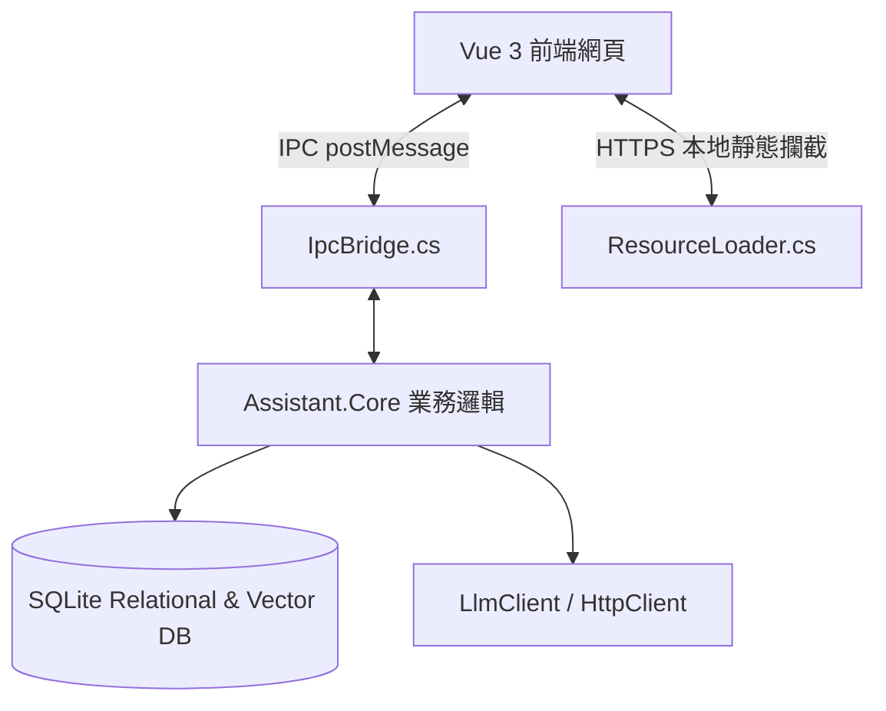

# 個人知識庫助理 (Personal Knowledge Base Assistant)

一個基於 **.NET 10** 與 **Vue 3 + Tailwind CSS v4** 建構的極致效能、本地化離線「個人知識庫助理」。本系統支援將輸入的文件自動進行大模型語意分析（RAG 整理、自動產生大綱）、產生嵌入向量（Embeddings）、高維度向量搜尋、DBSCAN 自動分群，並具備完整的知識版本控制（Version Control）與 Rollback 還原機制。

---

## 核心功能特點

1. **AI 智能導入與 RAG 整理**：
   * 支援導入 Markdown、TXT 與 JSON 格式文件。
   * 自動透過 OpenAI 相容的 LLM 進行智慧摘錄，將長文收斂為 400 字以內的結構化大綱（Outline）。
2. **混合向量資料庫（Simulated LanceDB）**：
   * 由於 Native AOT 的剪裁相容性，本專案在 SQLite 的基礎上設計了高效能的 C# 本地端向量儲存方案，以二進位 blob 形式儲存向量，並在記憶體中進行餘弦相似度（Cosine Similarity）評估與排序。
3. **語意路由與自動歸納**：
   * 使用相似度門檻值（預設 `0.82`）進行智慧路由：高相似度文章自動與現有條目進行 LLM 知識合併（Merge），低相似度則自動開闢為全新的主題條目。
4. **混合密度分群引擎 (DBSCAN)**：
   * 內建純 C# 實作的 DBSCAN 分群演算法，能對大綱向量進行冷啟動密度分群，自動找出隱藏的主題聚類並過濾噪點（Outliers）。
5. **版本控制系統（Version Control）**：
   * 每次知識庫條目發生合併更新時，舊版本將自動歸檔為歷史快照。
   * 提供前端一鍵版本回滾（Rollback）與完整歷史追蹤。
6. **本地端安全設定機制**：
   * 大模型與向量模型的 API 端點、金鑰（API Key）皆儲存於本地 `appsettings.json` 中。
   * 金鑰欄位採用 **AES-256 加密** 儲存，保護您的隱私。
---

## 本專案與傳統 RAG 及知識圖譜（Knowledge Graph / GraphRAG）的差異與設計考量

### 1. 與傳統 RAG（檢索增強生成）的差異
傳統 RAG 系統通常採用「切片（Chunking）+ 獨立向量檢索 + LLM 拼湊回答」的模式，這帶來了許多痛點：
* **碎片化與語意斷裂**：將文章切成固定長度（如 500 字）的片段，容易導致完整語意被切斷，問答時 LLM 拿到的只是碎片，缺乏全局上下文。
* **運行成本高 (Token 消耗大)**：每次查詢都需要檢索多個碎片（Top-K），並將大量 raw chunks 餵給 LLM，Token 消耗隨文件量呈線性或指數級增長。
* **知識庫混亂且無版本管理**：大量重複、衝突或過期的文件碎片並存，沒有定稿與知識演進的概念。

**本專案採用的「雙軌制增量融合 RAG」：**
* **語意路由與局部合併 (Merge)**：新文件導入時，先由 LLM 提煉 400 字大綱並進行語意相似度路由。若相似度高（$\ge 0.82$），則使用 LLM 將新資訊**增量融合**至既有的「知識條目（Knowledge Entry）」中，而非產生新的碎片；若相似度低，則自動開闢為全新的主題。
* **精準的局部 Context**：由於知識條目是高度結構化且整合過的完整主題文章，查詢與更新時 LLM 只需要關注該主題與新文件，保持在 LLM 最佳注意力區間，大幅降低 Token 消耗。
* **完整的知識版本控制**：每次進行知識合併時，系統會自動留存舊版並支持**一鍵回滾 (Rollback)**，讓知識管理具備高容錯性與可追溯性。

---

### 2. 為什麼不採用知識圖譜（Knowledge Graph / GraphRAG）？
雖然 GraphRAG 在關聯性分析上表現優異，但其背後的沉重代價使其不適合本專案的定位：
* **架構極度重型與複雜**：知識圖譜需要複雜的實體（Entities）與關係（Relations）提取，維護一個圖形資料庫（如 Neo4j）或複雜的圖形索引，與本專案「輕量、開箱即用」的理念不符。
* **高昂的 Token 與計算開銷**：建立圖譜關係需要對所有文件進行極高頻率的 LLM 呼叫，不僅建置與更新緩慢，API 費用也極度昂貴。
* **Native AOT 移植性差**：本專案的宗旨之一是能完全編譯為單一執行檔（Native AOT），在本地端 100% 離線運行。圖形資料庫及相關的圖演算法庫多數不相容於 .NET Native AOT，將嚴重破壞專案的打包與輕量化優勢。

**我們的替代方案：**
* 我們採用 **語意路由 + DBSCAN 密度分群**。透過 DBSCAN 純 C# 演算法對大綱向量進行冷啟動或定期局部聚類，自動在本地端找出隱藏的主題聚類並過濾噪點，在不依賴重型圖譜的前提下，依然實現了主題自動歸類與結構化整理。

---

## 系統架構

本專案採用 **Hybrid 混合架構**，前端與後端高度融合於單一二進位執行檔中，運作時無需連網。



* **展示層 (frontend)**：基於 Vue 3、Vite 與 Tailwind CSS v4 設計的 Obsidian 風格炫光黑面板。在瀏覽器獨立開發時具備完整的本地 Mock 機制。
* **桌面宿主 (Assistant.App)**：基於 WinForms + Microsoft WebView2 容器，透過自訂標準 `https://frontend.local/` 網域攔截，直接在記憶體中讀取內嵌資源（EmbeddedResource）回傳網頁，實現 100% 離線打包。
* **業務與資料層 (Assistant.Core)**：純 C# 實作，包含 SQLite 連接器、LLM 客戶端、向量引擎、分群引擎與版本控制。

---

## 專案結構規格

* `src/`：原始碼目錄
  * [Assistant.Core](file:///c:/workspace/knowledge_base/src/Assistant.Core)：核心邏輯庫，設計上完全不使用反射 JSON，為 AOT 相容。
  * [Assistant.App](file:///c:/workspace/knowledge_base/src/Assistant.App)：WinForms WebView2 桌面容器。
  * [frontend](file:///c:/workspace/knowledge_base/src/frontend)：Vue 3 + Vite 前端。
* `tests/`：測試目錄
  * [Assistant.Core.Tests](file:///c:/workspace/knowledge_base/tests/Assistant.Core.Tests)：xUnit 單元測試專案。
* `docs/`：系統規格設計書
  * [system_architecture_specification.md](file:///c:/workspace/knowledge_base/docs/system_architecture_specification.md)
  * [project_structure_specification.md](file:///c:/workspace/knowledge_base/docs/project_structure_specification.md)

---

## 開發環境設置

### 1. 前置需求
* 安裝 [.NET 10.0 SDK](https://dotnet.microsoft.com/)
* 安裝 [Node.js](https://nodejs.org/) 與 [pnpm](https://pnpm.io/)
* Windows 作業系統上需安裝 WebView2 Runtime

### 2. 開發階段（前後端分離與 HMR）
1. **啟動前端 Vite 開發伺服器**：
   ```bash
   cd src/frontend
   pnpm install
   pnpm run dev
   ```
   此時前端將在 `http://localhost:5173` 運行。
2. **啟動 C# 後端**：
   在 Debug 模式下啟動後端，WinForms 容器會自動將 WebView2 導向至本地開發伺服器（`http://localhost:5173`），讓您享有熱重載（HMR）開發體驗：
   ```bash
   cd src/Assistant.App
   dotnet run
   ```

---

## 測試與發布

### 1. 執行單元測試
```bash
dotnet test tests/Assistant.Core.Tests/Assistant.Core.Tests.csproj
```

### 2. 一鍵打包發布為單一執行檔
本專案已在 MSBuild pipeline 中高度優化，只需在 `Assistant.App` 目錄下一鍵發布即可。建置流程會自動偵測前端產物、編譯 Vue 專案、並將其打包嵌入二進位檔中：
```bash
cd src/Assistant.App
dotnet publish -c Release -r win-x64
```
* **發布產物位置**：`src/Assistant.App/bin/Release/net10.0-windows/win-x64/publish/`
* **獨立可執行檔**：`Assistant.App.exe` (~117MB)，雙擊即可完全離線運行！
