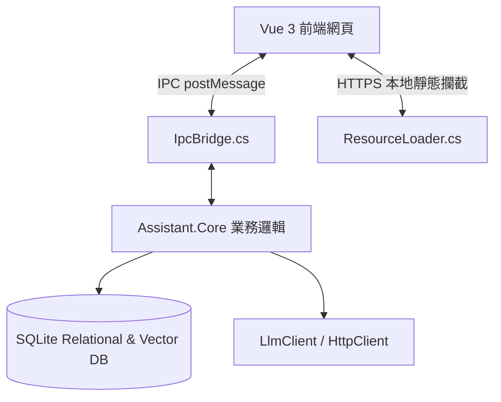

# 個人知識庫助理 (Personal Knowledge Base Assistant)

一個基於 **.NET 10** 與 **Vue 3 + Tailwind CSS v4** 建構的極致效能、本地化離線「個人知識庫助理」。本系統支援將輸入的文件自動進行大模型語意分析（RAG 整理、自動產生大綱）、產生嵌入向量（Embeddings）、高維度向量搜尋、DBSCAN 自動分群，並具備完整的知識版本控制（Version Control）與 Rollback 還原機制。

---

## 核心功能特點

1. **AI 智能導入與 RAG 整理**：
   * 支援導入 Markdown、TXT 與 JSON 格式文件。
   * 自動透過 OpenAI 相容的 LLM 進行智慧摘錄，將長文收斂為 400 字以內的結構化大綱（Outline）。
2. **混合向量資料庫（Simulated LanceDB）**：
   * 由於 Native AOT 的剪裁相容性，本專案在 SQLite 的基礎上設計了高效能的 C# 本地端向量儲存方案，以二進位 blob 形式儲存向量，並在記憶體中進行餘弦相似度（Cosine Similarity）評估與排序。
3. **語意路由與自動歸納**：
   * 使用相似度門檻值（預設 `0.82`）進行智慧路由：高相似度文章自動與現有條目進行 LLM 知識合併（Merge），低相似度則自動開闢為全新的主題條目。
4. **混合密度分群引擎 (DBSCAN)**：
   * 內建純 C# 實作的 DBSCAN 分群演算法，能對大綱向量進行冷啟動密度分群，自動找出隱藏的主題聚類並過濾噪點（Outliers）。
5. **版本控制系統（Version Control）**：
   * 每次知識庫條目發生合併更新時，舊版本將自動歸檔為歷史快照。
   * 提供前端一鍵版本回滾（Rollback）與完整歷史追蹤。
6. **本地端安全設定機制**：
   * 大模型與向量模型的 API 端點、金鑰（API Key）皆儲存於本地 `appsettings.json` 中。
   * 金鑰欄位採用 **AES-256 加密** 儲存，保護您的隱私。

---

## 系統架構

本專案採用 **Hybrid 混合架構**，前端與後端高度融合於單一二進位執行檔中，運作時無需連網。



* **展示層 (frontend)**：基於 Vue 3、Vite 與 Tailwind CSS v4 設計的 Obsidian 風格炫光黑面板。在瀏覽器獨立開發時具備完整的本地 Mock 機制。
* **桌面宿主 (Assistant.App)**：基於 WinForms + Microsoft WebView2 容器，透過自訂標準 `https://frontend.local/` 網域攔截，直接在記憶體中讀取內嵌資源（EmbeddedResource）回傳網頁，實現 100% 離線打包。
* **業務與資料層 (Assistant.Core)**：純 C# 實作，包含 SQLite 連接器、LLM 客戶端、向量引擎、分群引擎與版本控制。

---

## 專案結構規格

* `src/`：原始碼目錄
  * [`Assistant.Core`](file:///c:/workspace/assitant/src/Assistant.Core)：核心邏輯庫，設計上完全不使用反射 JSON，為 AOT 相容。
  * [`Assistant.App`](file:///c:/workspace/assitant/src/Assistant.App)：WinForms WebView2 桌面容器。
  * [`frontend`](file:///c:/workspace/assitant/src/frontend)：Vue 3 + Vite 前端。
* `tests/`：測試目錄
  * [`Assistant.Core.Tests`](file:///c:/workspace/assitant/tests/Assistant.Core.Tests)：xUnit 單元測試專案。
* `docs/`：系統規格設計書
  * [`system_architecture_specification.md`](file:///c:/workspace/assitant/docs/system_architecture_specification.md)
  * [`project_structure_specification.md`](file:///c:/workspace/assitant/docs/project_structure_specification.md)

---

## 開發環境設置

### 1. 前置需求
* 安裝 [.NET 10.0 SDK](https://dotnet.microsoft.com/)
* 安裝 [Node.js](https://nodejs.org/) 與 [pnpm](https://pnpm.io/)
* Windows 作業系統上需安裝 WebView2 Runtime

### 2. 開發階段（前後端分離與 HMR）
1. **啟動前端 Vite 開發伺服器**：
   ```bash
   cd src/frontend
   pnpm install
   pnpm run dev
   ```
   此時前端將在 `http://localhost:5173` 運行。
2. **啟動 C# 後端**：
   在 Debug 模式下啟動後端，WinForms 容器會自動將 WebView2 導向至本地開發伺服器（`http://localhost:5173`），讓您享有熱重載（HMR）開發體驗：
   ```bash
   cd src/Assistant.App
   dotnet run
   ```

---

## 測試與發布

### 1. 執行單元測試
```bash
dotnet test tests/Assistant.Core.Tests/Assistant.Core.Tests.csproj
```

### 2. 一鍵打包發布為單一執行檔
本專案已在 MSBuild pipeline 中高度優化，只需在 `Assistant.App` 目錄下一鍵發布即可。建置流程會自動偵測前端產物、編譯 Vue 專案、並將其打包嵌入二進位檔中：
```bash
cd src/Assistant.App
dotnet publish -c Release -r win-x64
```
* **發布產物位置**：`src/Assistant.App/bin/Release/net10.0-windows/win-x64/publish/`
* **獨立可執行檔**：`Assistant.App.exe` (~117MB)，雙擊即可完全離線運行！
