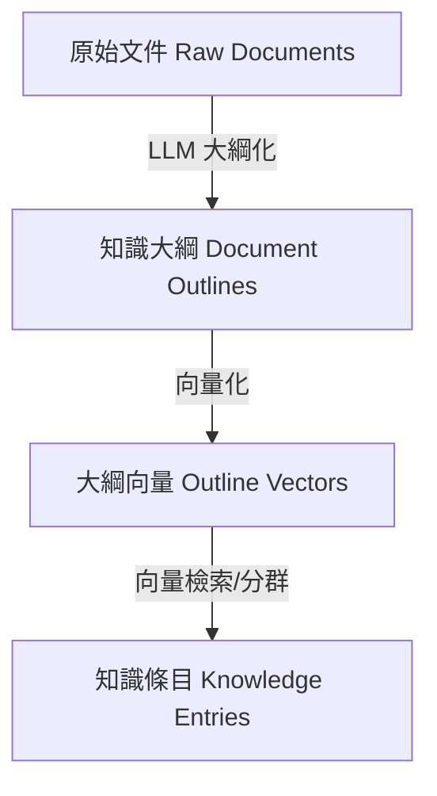
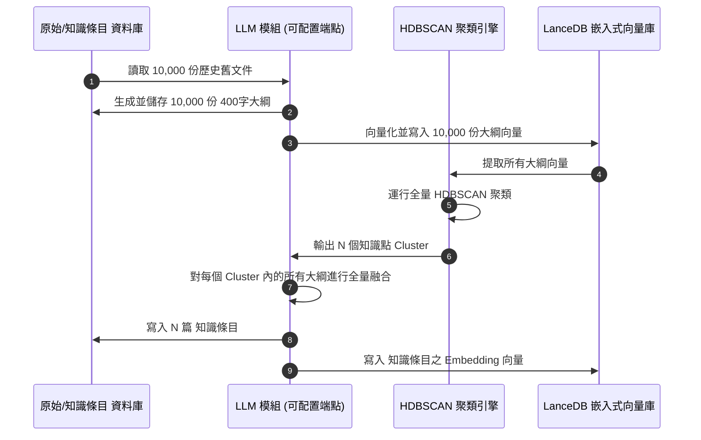
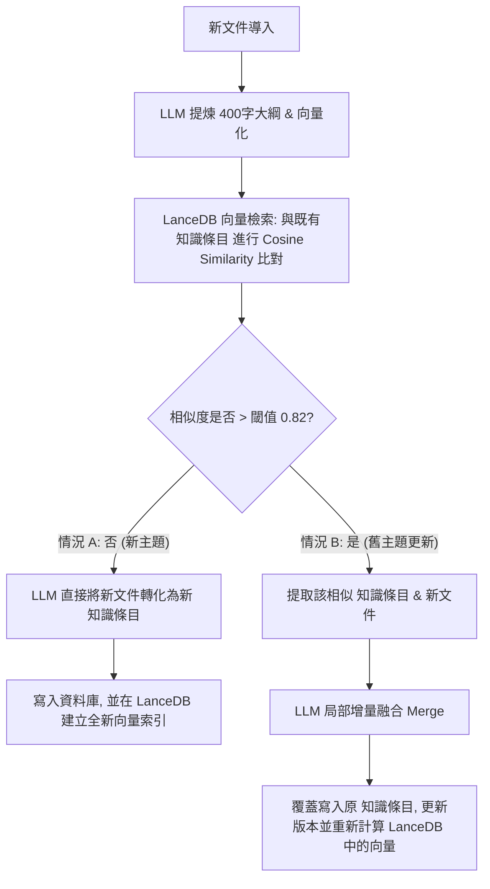
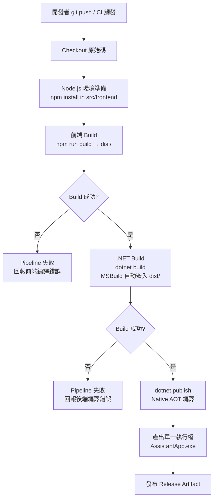

# 增量更新與混合分群知識庫系統規格書 (Incremental Update & Hybrid Clustering Knowledge Base System Specification)

本規格書定義了一套結合向量檢索、大語言模型（LLM）局部增量融合與密度聚類（HDBSCAN）的「雙軌制」知識庫管理系統。本系統旨在解決傳統知識庫在面對動態文檔更新時，全局重新整理所帶來的 Token 成本爆炸、AI 注意力渙散及知識遺忘退化等痛點，建立一個低成本、高精度的動態知識網絡。

---

## 1. 系統架構設計宗旨

在傳統知識庫系統中，每當有新文檔導入，若採用全局重新聚類與融合的方案，系統的計算複雜度將達到 $O(N)$ 甚至 $O(N^2)$。這將導致 Token 消耗隨著文檔累積呈雪崩式增長，且大模型的長文本注意力（Context Window Attention）也會因文本量過大而渙散，進而導致歷史已校正知識在重新整理過程中遺失或退化。

本系統採用**雙軌制架構 (Dual-Track Architecture)**，其核心宗旨為：
*   **日常寫入降維**：將全局的群集計算問題，降維成局部的向量檢索與 LLM 增量融合問題，日常運行複雜度為 $O(1)$。
*   **定期重組維護**：保留聚類演算法（HDBSCAN），但僅在定期維護（如每季或半年）時單獨針對新血進行局部校正，以解決知識漂移與散亂問題。
*   **確保知識完整度**：每一次更新都奠基於現有已校正的成果上進行修改，確保過去定稿的內容不會因 AI 的隨機性而消失。

---

## 2. 系統核心資料模型與實體

本系統內部主要處理並儲存以下三種核心資料實體：



### 2.1 原始文件 (Raw Documents)
*   **定義**：系統輸入的原始碎片化資料（如技術規格書、會議紀錄、客戶回饋等）。
*   **核心欄位**：
    *   `document_id` (UUID): 唯一識別碼
    *   `content` (Text): 原始文件全文內容
    *   `created_at` (Timestamp): 文件建立/導入時間戳記
    *   `source` (String): 來源渠道或檔名

### 2.2 知識大綱 (Document Outlines)
*   **定義**：原始文件經由 LLM 提煉後的結構化、去噪大綱（限制於 400 字左右）。
*   **核心欄位**：
    *   `outline_id` (UUID): 唯一識別碼
    *   `document_id` (UUID): 對應之原始文件識別碼
    *   `summary` (Text): 400 字的結構化大綱內容
    *   `vector` (Vector): 大綱內容的 Embedding 向量（儲存於 LanceDB 向量表，用於向量檢索與聚類分析）

### 2.3 知識條目 (Knowledge Entries)
*   **定義**：經由 LLM 將同類知識點融合成的結構化、高可讀性主題文章（即基石知識庫的最小單元）。
*   **核心欄位**：
    *   `entry_id` (UUID): 唯一識別碼
    *   `title` (String): 主題名稱/標題
    *   `content` (Text): 結構化的 知識條目內容
    *   `vector` (Vector): 知識條目的 Embedding 向量（儲存於 LanceDB 向量表）
    *   `version` (Integer): 版本號（用於版本控制與回滾）
    *   `updated_at` (Timestamp): 最後融合更新時間

---

## 3. 系統生命週期與三大運行階段

系統的生命週期分為三個階段：初始化階段、日常運行（增量）階段、定期維護階段。

### 3.1 初始化階段（Cold Start / System Initialization）
當系統剛上線、需要倒進大量歷史舊文件（例如 10,000 份歷史文件）時執行。此階段必須進行全量 Pipeline 以建立基石知識庫（Baseline）。



#### 詳細執行步驟：
1.  **大綱化與向量化**：將 10,000 份歷史舊文件輸入 LLM，各別產出約 400 字的結構化大綱。利用配置的 Embedding 模型計算大綱向量，並寫入 LanceDB。
2.  **全局聚類**：從 LanceDB 提取所有大綱向量，輸入 **HDBSCAN 聚類引擎** 進行全局分群。此步驟能自動識別出多個知識群組（例如聚合出 300 個 Cluster），並自動過濾噪聲/離群值。
3.  **基石融合**：針對這 300 個 Cluster，將每個群組內的文檔大綱與內容餵給 LLM，融合成 300 篇結構化的 知識條目。
4.  **建立 Baseline**：將這 300 篇 知識條目寫入資料庫，同時將其 Embedding 向量寫入 LanceDB 的 知識條目向量表，建立向量索引。此 300 篇文章即為系統的「基石知識庫」。

---

### 3.2 日常運行階段（Daily Ingestion & Incremental Update）
基石知識庫建立後，日常新文件寫入時運行的常態 Pipeline。此階段**完全告別 HDBSCAN**，實現低延遲與低成本。



#### 詳細執行步驟：
1.  **新文件去噪與定位**：新文件進入時，LLM 提煉 400 字大綱，並計算其大綱向量。
2.  **向量檢索**：將此大綱向量與 LanceDB 中的「既有 知識條目向量」進行相似度比對（而非與原始文檔碎片比對），獲取最相似的 知識條目。
3.  **分支路由決策**：
    *   **情況 A：找不到足夠相似的既有知識條目（新主題，如 $Cosine\ Similarity < 0.82$）**
        *   代表此新文件屬於全新知識領域。
        *   呼叫 LLM 將該新文件獨立轉化為一篇新的 知識條目。
        *   儲存至資料庫，同時在 LanceDB 中寫入其向量並加入索引。
    *   **情況 B：找到高度相似的既有知識條目（舊主題更新，如 $Cosine\ Similarity \ge 0.82$）**
        *   代表新文件會對現有的某個知識點產生「補充、修正或時序衝突」。
        *   進入步驟 4 進行局部融合。
4.  **LLM 局部增量融合（Merge）**：
    *   僅將該主題**「當前已整理好的 知識條目」**與帶有最新時間戳記的**「新文件」**作為 Context 輸入給 LLM。
    *   LLM 依照「增量融合規則」將新文件資訊編排進既有 知識條目中，產出「最新 知識條目」。
5.  **覆蓋與重新索引**：
    *   將最新 知識條目覆蓋寫入資料庫原本的 知識條目 欄位。
    *   將舊版本 知識條目 移至歷史版本表（Version History）以備回滾。
    *   重新計算最新 知識條目的 Embedding 向量並更新 LanceDB 向量索引。

---

### 3.3 定期維護階段（Periodic Re-indexing & Maintenance）
為解決長期運行中累積的結構性偏差，系統需保留定期（如每季或每半年）的維護機制。

#### 維護動機：
*   **知識漂移 (Concept Drift)**：某個 知識條目在半年內被累計更新了數十次，內容變得極為臃腫、承載了過多子主題，需要拆分。
*   **孤立主題的聚集**：日常運行中，有 20 篇新文件因未達相似度閾值而各自建立了 20 篇獨立的 知識條目。但在維護時，回頭看這 20 篇文章本質上都在講述同一個大型專案，需要整併。

#### 維護流程：
1.  **資料收集**：從 LanceDB 收集維護週期內所有新增之「原始文件大綱向量」。
2.  **局部 HDBSCAN 聚類**：對這些新增向量單獨跑一次 HDBSCAN 聚類，分析其內部是否有自動凝聚出的新群組（Cluster）。
3.  **知識庫結構重�---

## 7. 技術棧與部署架構 (Technology Stack & Software Architecture)

本系統採用高效的混合式桌面/邊緣端應用架構。後端核心使用 .NET 10 Native AOT 以確保極佳效能與輕量運行；前端使用者介面則為一個**完全獨立開發的前端專案**（基於 Vue 3, TS, Tailwind CSS），在編譯建置後以純靜態網頁形式由後端主程式透過 WebView 元件進行內嵌與渲染。向量儲存則使用無伺服器嵌入式資料庫 LanceDB。

```mermaid
graph LR
    subgraph 獨立前端專案 (Vue 3 + TS + Tailwind CSS)
        Vue[獨立前端開發與建置]
    end
    subgraph 後端核心 (.NET 10 Native AOT 主程式)
        WebView[WebView UI 容器]
        IPC[IPC 橋接機制]
        LLM_Client[LLM & Embedding 用戶端]
        LDB_Client[LanceDB 嵌入式驅動]
        CL_Mod[HDBSCAN 聚類模組]
    end
    subgraph 本地儲存 (Local Storage)
        LanceFiles[(LanceDB 資料檔)]
        LocalDB[(SQLite/LiteDB 資料檔)]
    end

    Vue -->|Vite 建置 dist| WebView
    WebView <-->|WebMessage IPC 通訊| IPC
    IPC <--> LLM_Client
    IPC <--> LDB_Client
    IPC <--> CL_Mod
    LDB_Client <--> LanceFiles
    CL_Mod <--> LocalDB
```

### 7.1 後端主程式：.NET 10 Native AOT
*   **編譯技術**：後端核心完全基於 **.NET 10**，並啟用 **Native AOT (Ahead-Of-Time)** 編譯。
*   **設計優勢**：
    *   **零 JIT 冷啟動延遲**：直接編譯為目標平台的原生二進位機器碼，啟動時間低於數十毫秒。
    *   **極低記憶體占用 (Low Memory Footprint)**：不需要載入龐大的 .NET JIT 編譯器與 Runtime，記憶體占用降至最低，適合長時間在背景執行的知識庫助手。
*   **Native AOT 開發約束**：
    *   **反射禁用與編譯時產生**：系統內部的 JSON 序列化與反序列化（例如 API 請求/響應、本地設定檔讀寫）**禁用執行期動態反射**，必須使用 .NET 10 的 **Source Generators (源碼產生器)** 機制。所有 DTO（資料傳輸物件）必須標記 `[JsonSerializable]`，由編譯器在編譯期靜態生成 JSON 序列化程式碼。
    *   **依賴項 AOT 相容性**：所有引入的 NuGet 套件（包含資料庫連接器、LLM 客戶端等）必須經過 AOT 相容性檢驗，避免在執行期觸發 dynamic code generation。

### 7.2 前端與使用者介面：獨立前端專案與 WebView 內嵌
*   **獨立專案開發 (Independent Frontend Project)**：
    *   前端程式碼作為一個**完全獨立的專案**存在，擁有自己獨立的目錄結構、依賴項管理（`package.json`）與建置流程（如使用 Vite 作為開發伺服器與打包工具）。後端 .NET 專案不干涉前端的開發細節。
    *   此設計實現了前後端團隊與技術棧的完全解耦。前端開發者可使用熱重載（Hot Reload）開發伺服器進行網頁 UI 獨立開發與調試，甚至可以在瀏覽器中透過 Mock API 進行完整的介面模擬測試，完全不需要運行 .NET 後端主程式。
*   **UI 承載與 WebView 架構**：
    *   在發佈時，採用輕量化的 WebView 元件（例如 Windows 平台上的 Microsoft Edge WebView2，或跨平台的 Photino 框架）內嵌於 .NET 10 後端主程式中。後端主程式僅作為 WebView 的容器，不需運行額外的瀏覽器或 Electron 程序。
*   **前端開發技術**：
    *   **Vue 3 (Composition API)**：作為獨立專案的前端視圖框架，建立反應式且高質感的互動元件。
    *   **TypeScript (TS)**：確保前端程式碼型別安全，降低前端與後端主程式雙向 IPC 橋接時的資料結構出錯率。
    *   **Tailwind CSS**：作為獨立前端的樣式系統，實現現代化、自適應且富質感的 UI（如毛玻璃效果、滑動微動畫、暗黑模式切換等）。
*   **打包與載入機制**：
    *   前端專案開發完成後，透過建置命令將 Vue 專案編譯為一個純靜態資源目錄（`dist/`，包含 `index.html` 以及編譯後的 CSS、JS、圖片等資產）。
    *   此 `dist/` 目錄會被以 **內嵌資源 (Embedded Resources)** 的形式，在編譯時直接封裝進後端 .NET 10 的單一執行檔中。
    *   **零網絡依賴與安全離線**：執行期 WebView 透過本地 Scheme 攔截器（如自訂的 `local://` 虛擬協議）直接從記憶體/嵌入式資源中讀取網頁內容並載入。系統不需要在用戶端啟用任何本地 HTTP Server 埠口（Port），從源頭消除了跨域限制（CORS）與網路安全隱患，達成 100% 離線運行。
*   **前後端雙向 IPC 通訊**：
    *   由於是獨立的前端專案與後端主程式結合，前後端溝通完全藉由 WebView 提供的原生 **IPC 橋接機制**進行通訊，避開網路層 HTTP 傳輸：
        *   **前端呼叫後端**：獨立前端透過 `window.chrome.webview.postMessage(jsonRequest)` 將操作指令（如文件導入、相似度查詢、組態儲存）傳送至 .NET。
        *   **後端回應前端**：.NET 監聽 `WebMessageReceived` 事件，解讀命令並在後端服務中異步處理後，再透過 `CoreWebView2.PostWebMessageAsString(jsonResponse)` 將執行結果回傳給前端專案，Vue 接收到回應後更新畫面狀態。 知識條目的結構化 Markdown 格式。
* 輸出內容必須完整，不可使用「其餘內容同原文章」、「（此處省略...）」等簡略標記，必須輸出融合後的完整文章內容。
```

---

## 5. 系統效能與複雜度對比分析

下表詳細對比了本系統採用的**「雙軌制（向量檢索 + 增量 Merge + 定期維護）」**方案與**「全量重新整理」**方案的差異：

| 評估維度 | 傳統全量重新整理方案 | 本系統雙軌制方案 | 效益分析 |
| :--- | :--- | :--- | :--- |
| **日常寫入複雜度** | $O(N)$ 到 $O(N^2)$ (每次都要重跑聚類與重寫 知識條目) | **$O(1)$** (僅進行向量搜尋與單一 知識條目 融合) | 顯著提升系統回應速度與寫入吞吐量。 |
| **LLM Token 消耗** | 隨著歷史文件量呈線性或指數級爆炸 | **恆定常數 (固定極低)** (每次僅讀取 1 篇 知識條目 + 1 份新文件) | 大幅節約 API 呼叫成本，實現系統低成本營運。 |
| **大模型注意力** | 因長文本 Context 負擔過重，容易產生細節遺忘與幻覺 | **集中於局部 Context** (維持在 LLM 的最佳運算區間) | 確保生成的知識文章精確度，避免遺失關鍵歷史細節。 |
| **知識穩定性** | 每次重新融合都有可能因隨機性導致舊文章被改爛 | **奠基於已校正 知識條目 增量修改** (歷史精確內容得以繼承) | 避免知識退化，提升企業內部知識庫的可靠性。 |
| **版本控制與回滾** | 全局重構後極難針對單一主題進行版本追溯 | **清晰的 知識條目 單篇文章版本控制** (可直接 Rollback) | 容錯率高，若融合結果不佳可隨時一鍵還原至上個版本。 |

---

## 6. 資料庫儲存與架構實作設計

為支持此系統之運行，資料庫端採用混合式儲存架構，結合本地關聯式/文件資料庫與嵌入式向量資料庫（LanceDB）：

```mermaid
graph LR
    subgraph 本地關聯式/文件資料庫
        R[原始文件表 raw_documents]
        W[知識條目表 knowledge_entries]
        H[知識條目版本歷史表 knowledge_versions]
    end
    subgraph 嵌入式向量資料庫 (LanceDB)
        OV[大綱向量表 document_outlines_vector]
        WV[條目向量表 knowledge_entries_vector]
    end
    
    R -->|對應大綱| OV
W -->|寫入條目向量| WV
    W -->|寫入條目向量| WV|變更記錄| H
```

### 6.1 資料庫表結構 (Database Schema)

#### 1. 原始文件表 (`raw_documents`)
```sql
CREATE TABLE raw_documents (
    document_id VARCHAR(36) PRIMARY KEY,
    content TEXT NOT NULL,
    created_at TIMESTAMP NOT NULL,
    source VARCHAR(255)
);
```

#### 2. 知識條目表 (`knowledge_entries`)
```sql
CREATE TABLE knowledge_entries (
    entry_id VARCHAR(36) PRIMARY KEY,
    title VARCHAR(255) NOT NULL,
    content TEXT NOT NULL,
    version INT NOT NULL DEFAULT 1,
    created_at TIMESTAMP NOT NULL DEFAULT CURRENT_TIMESTAMP,
    updated_at TIMESTAMP NOT NULL DEFAULT CURRENT_TIMESTAMP
);
```

#### 3. 知識條目歷史版本表 (`knowledge_versions`)
```sql
CREATE TABLE knowledge_versions (
    version_id VARCHAR(36) PRIMARY KEY,
    entry_id VARCHAR(36) REFERENCES knowledge_entries(entry_id),
    content TEXT NOT NULL,
    version INT NOT NULL,
    updated_at TIMESTAMP NOT NULL
);
```

#### 4. LanceDB 向量儲存模型 (LanceDB Schemas)
由於 LanceDB 採用直欄式儲存，可直接將向量與主鍵/Metadata 一併存放：
*   **`document_outlines_vector` 欄位**：
    *   `outline_id` (String): 主鍵
    *   `document_id` (String): 關聯原始文件 ID
    *   `summary` (String): 400字大綱（輔助語意過濾）
    *   `vector` (Float32 Array): 大綱之高維 Embedding 向量
*   **`knowledge_entries_vector` 欄位**：
    *   `entry_id` (String): 主鍵（對應 `knowledge_entries` 的 `entry_id`）
    *   `title` (String): 主題標題
    *   `vector` (Float32 Array): 知識條目之高維 Embedding 向量

### 6.2 系統架構元件模組
1.  **Ingestion Service (導入服務)**：負責接收新文件，呼叫配置之 Embedding 端點生成大綱向量，並寫入 LanceDB。
2.  **Search & Routing Engine (檢索與路由引擎)**：使用 LanceDB .NET SDK 執行 Cosine 相似度查詢，進行閾值路由決策。
3.  **LLM Merge Engine (LLM 融合引擎)**：使用配置的 LLM 端點、API Key 與指定模型，調用大語言模型執行增量 Merge。
4.  **Clustering Engine (HDBSCAN 聚類引擎)**：封裝 HDBSCAN 分群演算法，供初始化與定期維護時調用。
5.  **Version Control System (版本控制模組)**：在覆蓋 知識條目 前，將舊內容備份至 `knowledge_versions`，確保系統隨時可執行 Rollback。

---

## 7. 技術棧與部署架構 (Technology Stack & Software Architecture)

本系統採用高效的混合式桌面/邊緣端應用架構，後端使用 .NET 10 Native AOT 以確保極佳效能，前端使用 WebView 內嵌基於 Vue 3 的靜態網頁，向量儲存則使用無伺服器嵌入式資料庫 LanceDB。

```mermaid
graph LR
    subgraph 使用者介面 (Frontend UI - WebView)
        Vue[Vue 3 + TS + Tailwind CSS]
    end
    subgraph 後端核心 (Backend Core - .NET 10 Native AOT)
        IPC[IPC 橋接機制]
        LLM_Client[LLM & Embedding 用戶端]
        LDB_Client[LanceDB 嵌入式驅動]
        CL_Mod[HDBSCAN 聚類模組]
    end
    subgraph 本地儲存 (Local Storage)
        LanceFiles[(LanceDB 資料檔)]
        LocalDB[(SQLite/LiteDB 資料檔)]
    end

    Vue <-->|WebMessage IPC 通訊| IPC
    IPC <--> LLM_Client
    IPC <--> LDB_Client
    IPC <--> CL_Mod
    LDB_Client <--> LanceFiles
    CL_Mod <--> LocalDB
```

### 7.1 後端主程式：.NET 10 Native AOT
*   **編譯技術**：後端核心完全基於 **.NET 10**，並啟用 **Native AOT (Ahead-Of-Time)** 編譯。
*   **設計優勢**：
    *   **零 JIT 冷啟動延遲**：直接編譯為目標平台的原生二進位機器碼，啟動時間低於數十毫秒。
    *   **極低記憶體占用 (Low Memory Footprint)**：不需要載入龐大的 .NET JIT 編譯器與 Runtime，記憶體占用降至最低，適合長時間在背景執行的知識庫助手。
*   **Native AOT 開發約束**：
    *   **反射禁用與編譯時產生**：系統內部的 JSON 序列化與反序列化（例如 API 請求/響應、本地設定檔讀寫）**禁用執行期動態反射**，必須使用 .NET 10 的 **Source Generators (源碼產生器)** 機制。所有 DTO（資料傳輸物件）必須標記 `[JsonSerializable]`，由編譯器在編譯期靜態生成 JSON 序列化程式碼。
    *   **依賴項 AOT 相容性**：所有引入的 NuGet 套件（包含資料庫連接器、LLM 客戶端等）必須經過 AOT 相容性檢驗，避免在執行期觸發 dynamic code generation。

### 7.2 前端與使用者介面：WebView 內嵌靜態網頁
*   **UI 承載架構**：採用輕量化的 WebView 元件（例如 Windows 平台上的 Microsoft Edge WebView2，或跨平台的 Photino 框架）內嵌於 .NET 10 主程式中，不需運行額外的瀏覽器或 Electron 程序。
*   **前端開發技術**：
    *   **Vue 3 (Composition API)**：作為前端視圖框架，建立反應式且高質感的互動元件。
    *   **TypeScript (TS)**：確保前端程式碼型別安全，降低與後端資料交互時的結構性錯誤。
    *   **Tailwind CSS**：作為樣式系統，實現高度客製化、動態且極具質感的現代化 UI（如毛玻璃效果、暗黑模式等）。
*   **打包與載入機制**：
    *   前端專案在開發完成後，透過編譯工具（如 Vite）打包成單一的靜態網頁資源目錄（`dist/`，包含 HTML, CSS, JS 與圖片）。
    *   此靜態目錄以 **內嵌資源 (Embedded Resources)** 形式編譯進 .NET 10 的二進位執行檔中。
    *   **零網絡依賴**：在執行期，WebView 透過本地 Scheme 攔截器（如自訂 Local URI Scheme）直接讀取二進位檔中的靜態資源進行載入。系統完全不需開啟 HTTP 埠口（Port），消除了 CORS 跨域問題，且具備完全的離線執行能力。
*   **IPC 雙向通訊**：
    *   **前端呼叫後端**：Vue 透過 `window.chrome.webview.postMessage(jsonRequest)` 將命令（如導入文件、相似度查詢、設定變更）發送給後端。
    *   **後端回應前端**：.NET 監聽 `WebMessageReceived` 事件，解讀命令並在後端異步執行後，透過 `CoreWebView2.PostWebMessageAsString(jsonResponse)` 將執行結果異步回傳給前端。

### 7.3 向量資料庫：LanceDB
*   **資料庫架構**：選用 **LanceDB** 作為系統的向量資料庫。
*   **Serverless 嵌入式設計**：
    *   LanceDB 屬於無伺服器（Embedded/Serverless）向量資料庫，以 Rust 開發的 Lance 格式為基礎。
    *   **免安裝免運作**：資料庫直接以本地資料夾與檔案的形式存在（例如存放於用戶端 AppData 的 `lancedb/` 目錄），不需在使用者電腦上安裝或啟動額外的資料庫服務程序（如 Milvus, PgVector 或 Qdrant），實現真正的「即裝即用」。
*   **AOT 與 Native Interop 整合**：
    *   .NET 10 主程式透過 C-API 橋接或專用 .NET 綁定與 LanceDB 進行 Native Interop 通訊，底層資料讀寫由 Rust 核心以零拷貝（Zero-copy）與向量化（SIMD）加速完成。此機制完全繞過 JIT，與 Native AOT 編譯完美契合。
    *   支援磁碟磁區（Disk-backed）儲存與索引（例如 IVF-PQ 索引），在資料量大於記憶體時仍能保持極速的 Top-K 向量檢索。

### 7.4 靈活的 LLM 與 Embedding 組態配置 (LLM & Embedding Configuration)
系統必須具備完整的參數化配置能力，使用者可透過 WebView 的前端設定介面，動態設定並即時套用不同的 LLM 與 Embedding 提供端點（例如 OpenAI、Anthropic、Gemini、DeepSeek，或本地運行的 Ollama 及 Llama.cpp）。

```json
// 配置檔 appsettings.json 結構範例
{
  "LlmConfig": {
    "Endpoint": "https://api.deepseek.com/v1",
    "ApiKey": "sk-xxxxxxxxxxxxxxxxxxxxxxxx",
    "ModelName": "deepseek-chat"
  },
  "EmbeddingConfig": {
    "Endpoint": "https://api.openai.com/v1",
    "ApiKey": "sk-yyyyyyyyyyyyyyyyyyyyyyyy",
    "ModelName": "text-embedding-3-small"
  }
}
```

*   **參數配置欄位說明**：
    *   **LLM 模組（用於大綱化、基石融合及增量 Merge）**：
        *   `Endpoint`：API 端點網址（例如 `https://api.openai.com/v1` 或本地 `http://localhost:11434/v1`）。
        *   `ApiKey`：認證授權金鑰（若使用本地 Ollama 可為空或任意字串）。
        *   `ModelName`：模型型號名稱（例如 `gpt-4o`、`deepseek-chat`、`llama3`）。
    *   **Embedding 模組（用於大綱與 知識條目向量計算）**：
        *   `Endpoint`：Embedding API 端點網址。
        *   `ApiKey`：認證授權金鑰。
        *   `ModelName`：向量模型名稱（例如 `text-embedding-3-small`、`bge-m3`）。
*   **動態載入與生命週期管理**：
    *   **資料儲存**：設定參數加密存放於本地 SQLite 或設定檔 `appsettings.json` 中。
    *   **動態變更**：當使用者在前端 UI 修改端點或 ApiKey 並儲存後，後端透過 IPC 接收新設定，調用內部 Client Factory 銷毀舊有的 HTTP Client 與 API Client 實例，重新使用新參數初始化連線。此過程無需重啟應用程式即可即時生效。
    *   **錯誤處理**：系統提供「連線測試」機制。在儲存設定前，後端會向設定的 Endpoint 發送微型測試請求（如 LLM 的簡單 Chat 測試或 Embedding 的單字向量化測試），驗證 ApiKey 與端點的有效性，若失敗則回傳詳細錯誤代碼給前端 UI。

---

## 8. 前端 Build Pipeline 規格 (Frontend Build Pipeline Specification)

### 8.1 概述

前端為**完全獨立的專案**（位於 `src/frontend/` 目錄），使用 **Vite** 作為建置工具。  
Build Pipeline 的職責是將 Vue 3 + TypeScript + Tailwind CSS 的原始碼，編譯為最終靜態網頁資產（`dist/`），再由 .NET 建置流程將其打包為 **嵌入資源（Embedded Resources）** 內嵌進主程式執行檔。

```
src/
├── frontend/          ← 前端獨立專案根目錄
│   ├── package.json
│   ├── vite.config.ts
│   ├── tsconfig.json
│   ├── tailwind.config.js
│   ├── src/           ← Vue 3 原始碼
│   │   ├── main.ts
│   │   ├── App.vue
│   │   └── components/
│   └── dist/          ← Vite build 輸出目錄（不納入版控）
└── backend/           ← .NET 10 Native AOT 主程式
    └── AssistantApp.csproj
```

---

### 8.2 建置工具鏈 (Toolchain)

| 工具 | 版本要求 | 用途 |
|------|----------|------|
| Node.js | ≥ 20 LTS | 前端開發執行環境 |
| npm / pnpm | npm ≥ 10 或 pnpm ≥ 9 | 套件管理 |
| Vite | ≥ 5.x | 開發伺服器 & 生產建置打包 |
| Vue 3 | ≥ 3.4 | UI 框架（Composition API） |
| TypeScript | ≥ 5.x | 型別安全 |
| Tailwind CSS | ≥ 3.x | 原子化樣式系統 |

---

### 8.3 建置指令 (Build Commands)

#### 開發模式（熱重載 HMR）
```bash
cd src/frontend
npm install        # 安裝依賴（首次或 package.json 變更後）
npm run dev        # 啟動 Vite Dev Server（僅供前端 UI 開發除錯用）
```
> **注意**：Dev Server 模式下，WebView 需指向 `http://localhost:5173`（或 Vite 設定的 port）。  
> 此模式**不**用於正式執行，僅作為前端開發的快速迭代環境。

#### 生產建置（輸出靜態資產）
```bash
cd src/frontend
npm install        # 確保依賴安裝
npm run build      # 執行 Vite 生產建置，輸出至 dist/
```
`npm run build` 等效於 `vite build`，會產生：
```
src/frontend/dist/
├── index.html
├── assets/
│   ├── index-[hash].js    ← 打包後的 JS（含 Vue runtime）
│   └── index-[hash].css   ← 打包後的 CSS（含 Tailwind purge）
└── favicon.ico
```

---

### 8.4 Vite 建置設定要點 (`vite.config.ts`)

```typescript
import { defineConfig } from 'vite'
import vue from '@vitejs/plugin-vue'

export default defineConfig({
  plugins: [vue()],
  build: {
    // 輸出目錄（相對於 frontend 專案根）
    outDir: 'dist',
    // 清空舊輸出
    emptyOutDir: true,
    // 關閉 source map（減少嵌入體積）
    sourcemap: false,
    // rollup 選項：確保單一 JS 入口，便於嵌入資源引用
    rollupOptions: {
      output: {
        // 固定輸出檔名（不含 hash），簡化 .NET Embedded Resource 路徑引用
        entryFileNames: 'assets/index.js',
        chunkFileNames: 'assets/[name].js',
        assetFileNames: 'assets/[name].[ext]',
      },
    },
  },
  // 確保所有資源使用相對路徑（WebView 本地 Scheme 載入必要）
  base: './',
})
```

> **關鍵設定 `base: './'`**：使所有靜態資源引用採用相對路徑，確保在 WebView 自訂 Local URI Scheme 下可正確載入，無需 HTTP server 介入。

---

### 8.5 與 .NET 建置流程的整合 (MSBuild Integration)

前端 Build 必須在 .NET 建置（`dotnet build` / `dotnet publish`）**之前**自動完成，並將 `dist/` 內容以 **Embedded Resources** 形式打包進執行檔。

#### 8.5.1 MSBuild Target 設定（`AssistantApp.csproj`）

```xml
<Project Sdk="Microsoft.NET.Sdk">
  <PropertyGroup>
    <OutputType>Exe</OutputType>
    <TargetFramework>net10.0</TargetFramework>
    <PublishAot>true</PublishAot>
    <!-- 前端原始碼根目錄（相對於 .csproj） -->
    <FrontendDir>$(MSBuildProjectDirectory)/../frontend</FrontendDir>
    <!-- Vite 輸出目錄 -->
    <FrontendDistDir>$(FrontendDir)/dist</FrontendDistDir>
  </PropertyGroup>

  <!-- Target 1: 在 .NET 建置前執行前端 Build -->
  <Target Name="BuildFrontend" BeforeTargets="Build;Publish">
    <Message Text="[Build Pipeline] Running npm install..." Importance="high" />
    <Exec Command="npm install" WorkingDirectory="$(FrontendDir)" />
    <Message Text="[Build Pipeline] Running vite build..." Importance="high" />
    <Exec Command="npm run build" WorkingDirectory="$(FrontendDir)" />
  </Target>

  <!-- Target 2: 將 dist/ 下所有靜態資源宣告為 Embedded Resource -->
  <Target Name="IncludeFrontendDist" AfterTargets="BuildFrontend" BeforeTargets="BeforeBuild">
    <ItemGroup>
      <EmbeddedResource
        Include="$(FrontendDistDir)/**/*"
        LogicalName="frontend/%(RecursiveDir)%(Filename)%(Extension)" />
    </ItemGroup>
  </Target>
</Project>
```

#### 8.5.2 嵌入資源命名規則

| 實體檔案路徑 | 嵌入資源 LogicalName |
|---|---|
| `dist/index.html` | `frontend/index.html` |
| `dist/assets/index.js` | `frontend/assets/index.js` |
| `dist/assets/index.css` | `frontend/assets/index.css` |
| `dist/favicon.ico` | `frontend/favicon.ico` |

後端透過 `Assembly.GetManifestResourceStream("frontend/index.html")` 讀取對應資源。

---

### 8.6 WebView 載入流程（本地 Scheme 攔截）

```csharp
// .NET 後端：啟動時向 WebView 註冊自訂 URI Scheme
webView.CoreWebView2.AddWebResourceRequestedFilter(
    "app://*", CoreWebView2WebResourceContext.All);

webView.CoreWebView2.WebResourceRequested += (sender, args) =>
{
    // 將 "app://frontend/assets/index.js" 映射至嵌入資源
    var uri = new Uri(args.Request.Uri);
    var resourcePath = uri.AbsolutePath.TrimStart('/');  // → "frontend/assets/index.js"

    var stream = Assembly
        .GetExecutingAssembly()
        .GetManifestResourceStream(resourcePath);

    if (stream is not null)
    {
        var contentType = GetContentType(resourcePath);  // "text/javascript", "text/css", ...
        args.Response = webView.CoreWebView2.Environment
            .CreateWebResourceResponse(stream, 200, "OK",
                $"Content-Type: {contentType}");
    }
};

// 導向至前端入口
webView.CoreWebView2.Navigate("app://frontend/index.html");
```

---

### 8.7 CI/CD 建置流程（完整 Pipeline 步驟）



#### 步驟說明

| 步驟 | 指令 | 說明 |
|------|------|------|
| 1. 前端安裝依賴 | `npm install` (in `src/frontend/`) | 安裝 node_modules |
| 2. 前端生產建置 | `npm run build` (in `src/frontend/`) | Vite 輸出 `dist/` |
| 3. .NET 建置 | `dotnet build` (in `src/backend/`) | MSBuild 自動觸發前端 Build 並嵌入資源 |
| 4. 發布（AOT 編譯） | `dotnet publish -c Release -r win-x64` | 產出 Native AOT 單一執行檔 |

> **注意**：步驟 3 的 MSBuild Target `BuildFrontend` 會再次執行 `npm run build`，因此若確保 `dist/` 已是最新狀態，可在 CI 中透過環境變數跳過重複建置（例如設定 `<Condition>` 判斷 `dist/` 是否存在）。

---

### 8.8 開發環境建置注意事項

*   **`dist/` 不納入版控**：應在 `.gitignore` 中排除 `src/frontend/dist/`，避免大量編譯產物污染版控。
*   **`node_modules/` 不納入版控**：同樣排除 `src/frontend/node_modules/`。
*   **開發階段熱重載**：前端開發期間，可在 `src/frontend/` 執行 `npm run dev` 啟動 Vite Dev Server，並在後端程式碼中以條件編譯（`#if DEBUG`）將 WebView 導向 `http://localhost:5173`，享有 HMR（熱模組替換）的快速開發體驗。
*   **生產建置驗證**：每次提交前建議執行完整 `npm run build && dotnet build` 確保靜態資產正確嵌入。

